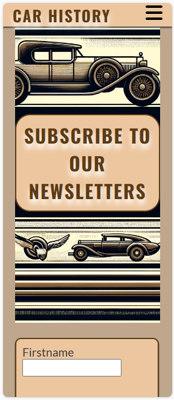

# Car History
## Description
Car History is a web page designed for enthusiasts and historians interested in the evolution of automobiles. This project provides a detailed journey through the history of car manufacturing, highlighting significant milestones and key figures in the industry.

## Screenshots

 
 
 

## Installation
No installation is required to enjoy Car History. Simply visit the website to start exploring the fascinating world of automobiles.
## Testing
Cars.html passed the HTML checker:

People.html passed the HTML checker:

Index.html passed the HTML checker:

Signup.html passed the HTML checker:

Style.css passed the CSS checker:

## Usage
The project is divided into four main sections:

**The Evolution of Automobiles**: A comprehensive overview of car history.
**Influential Figures**: Profiles of significant individuals in car manufacturing.
**Milestone Cars**: Highlighting key models that have shaped automotive history.
**Stay Informed**: A sign-up page for those interested in receiving future updates and in-depth articles.

## Sources

The creation of Car History was supported by several resources:

[Image Color Picker](https://imagecolorpicker.com/): Used for selecting a harmonious color palette. 
[GPT-4](https://chat.openai.com/?model=gpt-4): Utilized for generating images, texts, and providing explanations of elements.
[Google](www.google.com): Employed for image research.
[HTML](https://validator.w3.org/) and [CSS](https://jigsaw.w3.org/css-validator/) Validator: Ensured the project is error-free and adheres to web standards.
Roadmap
As of now, there are no planned updates for Car History. However, the site will continue to provide valuable information for its users.

License
The images used in this project may be subject to copyright. Users are advised to respect the ownership rights of all visual materials. The code of the project is available for use and modification under the terms specified in the project repository.

Contact Information
For further inquiries or feedback, please contact:

Peter Rimaszecsi
Email: rim.peter@hotmail.com

