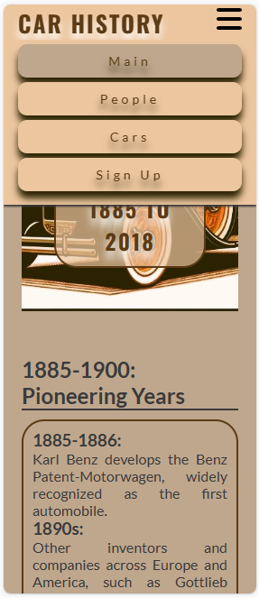
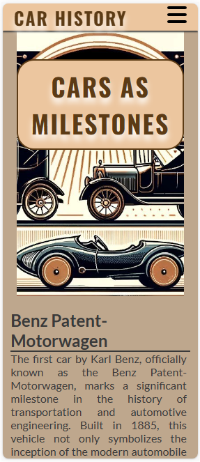
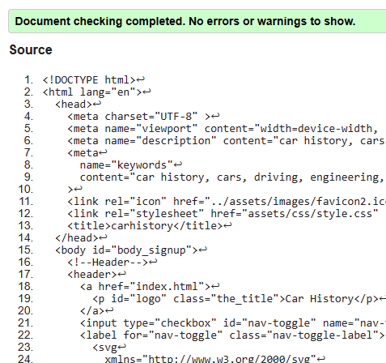

# Car History
## Description
Car History is a web page designed for enthusiasts and historians interested in the evolution of automobiles. This project provides a detailed journey through the history of car manufacturing, highlighting significant milestones and key figures in the industry.

## Screenshots
### Large screen view:

### tablet view:

### mobile view:
 
 
 

## For General Users
To experience the Car History website, **no installation is required**. Simply visit the website to immerse yourself in the world of automobiles. This accessibility ensures that anyone with internet access can enjoy the content seamlessly.

## For Developers
If you're interested in contributing or further developing the project, here's how you can get involved:

- **Forking or Cloning**: Feel free to fork or clone this repository. This allows you to make your own modifications and improvements to the Car History project.
- **Setting Up Your Environment**: After forking or cloning, set up your local environment for development. Additional setup instructions are available upon request or in the project documentation.

## Testing
### Cars.html passed the HTML checker:

### People.html passed the HTML checker:

### Index.html passed the HTML checker:

### Signup.html passed the HTML checker:

### Style.css passed the CSS checker:

### Sign Up test for data:

### Sign Up test on email section:

## Usage
The project is divided into four main sections:

- **The Evolution of Automobiles**: A comprehensive overview of car history.
- **Influential Figures**: Profiles of significant individuals in car manufacturing.
- **Milestone Cars**: Highlighting key models that have shaped automotive history.
- **Stay Informed**: A sign-up page for those interested in receiving future updates and in-depth articles.

## Design and Color Scheme

In designing the **Car History** website, special attention was given to the color scheme and typography to create a visually engaging and thematic experience for the users.

### Color Selection
For the primary color scheme, I chose a palette centered around _"sand brown"_. This color choice was made with the theme of car history in mind, believing it perfectly encapsulates the essence of the site. The shades of "sand brown" were carefully selected using [Image Color Picker](https://imagecolorpicker.com/) to ensure a cohesive and engaging visual experience.

### Font Style
The typography on the Car History website follows the font style used in the "Love Running" project. This decision was made to ensure readability and visual appeal. The color of the text is in harmony with the background color scheme, adhering to the "sand brown" palette. This approach creates a seamless and aesthetically pleasing interface.

## Sources

### The creation of Car History was supported by several resources:

- [Image Color Picker](https://imagecolorpicker.com/): Used for selecting a harmonious color palette. 
- [GPT-4](https://chat.openai.com/?model=gpt-4): Utilized for generating images, texts, and providing explanations of elements.
- [Google](www.google.com): Employed for image research.
- [HTML](https://validator.w3.org/) and [CSS](https://jigsaw.w3.org/css-validator/) Validator: Ensured the project is error-free and adheres to web standards.
- [readme template](https://github.com/Code-Institute-Solutions/readme-template)
- [HTML full template](https://github.com/Code-Institute-Org/ci-full-template)
- Love Running Project: I've adapted and applied some of its codes and methodologies to the Car History project, crucial in shaping its functionality and design.

## Roadmap
As of now, there are no planned updates for Car History. However, the site will continue to provide valuable information for its users.

## License
The images used in this project may be subject to copyright. Users are advised to respect the ownership rights of all visual materials. The code of the project is available for use and modification under the terms specified in the project repository.

## Contact Information
For further inquiries or feedback, please contact:

Peter Rimaszecsi
Email: rim.peter@hotmail.com

